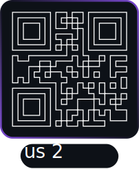

<p align="center"></p>

[QRious2](https://github.com/TaraRostami/qrious2/) is a pure JavaScript library for generating QR codes using HTML5 canvas.

[](https://github.com/TaraRostami/qrious2/releases)
[](https://tararostami.github.io/qrious2/)
[](https://t.me/tararostami)
[](https://github.com/TaraRostami/qrious2/blob/master/LICENSE.md)
[](https://www.npmjs.com/package/qrious2)

* [Install](#install)
* [Examples](#examples)
* [API](#api)
* [Migrating from older versions](#migrating-from-older-versions)
* [Bugs](#bugs)
* [Contributors](#contributors)
* [License](#license)

## Install

Install using the package manager for your desired environment(s):

``` bash
$ npm install --save qrious2
# OR:
$ bower install --save qrious2
```

If you want to simply download the file to be used in the browser you can find them below:

* [Development Version](https://cdn.jsdelivr.net/gh/TaraRostami/qrious2/dist/qrious2.js) (73kb - [Source Map](https://cdn.jsdelivr.net/gh/TaraRostami/qrious2/dist/qrious2.js.map))
* [Production Version](https://cdn.jsdelivr.net/gh/TaraRostami/qrious2/dist/qrious2.min.js) (18kb - [Source Map](https://cdn.jsdelivr.net/gh/TaraRostami/qrious2/dist/qrious2.min.js.map))

Check out [node-qrious](https://github.com/neocotic/node-qrious) if you want to install it for use within
[Node.js](https://nodejs.org).

## Examples

``` html
<!DOCTYPE html>
<html>
  <body>
    <canvas id="qr"></canvas>

    <script src="/path/to/qrious.js"></script>
    <script>
      (function() {
        var qr = new QRious({
          element: document.getElementById('qr'),
          value: 'https://github.com/tararostami/qrious2'
        });
      })();
    </script>
  </body>
</html>
```

Open up `demo.html` in your browser to play around a bit.

## API

Simply create an instance of `QRious` and you've done most of the work. You can control many aspects of the QR code
using the following fields on your instance:

| Field           | Type    | Description                                        | Default       | Read Only |
| --------------- | ------- | -------------------------------------------------- | ------------- | --------- |
| background      | String  | Background color of the QR code                    | `"white"`     | No        |
| backgroundAlpha | Number  | Background alpha of the QR code                    | `1.0`         | No        |
| element         | Element | Element to render the QR code                      | `<canvas>`    | Yes       |
| foreground      | String  | Foreground color of the QR code                    | `"black"`     | No        |
| foregroundAlpha | Number  | Foreground alpha of the QR code                    | `1.0`         | No        |
| level           | String  | Error correction level of the QR code (L, M, Q, H) | `"L"`         | No        |
| mime            | String  | MIME type used to render the image for the QR code | `"image/png"` | No        |
| padding         | Number  | Padding for the QR code (pixels)                   | `null` (auto) | No        |
| size            | Number  | Size of the QR code (pixels)                       | `100`         | No        |
| value           | String  | Value encoded within the QR code                   | `""`          | No        |
| positionSep     | String  | Separating cells of positions in QR Code           | `"D"`         | No        |
| dataSep         | String  | Separating cells of data in QR Code                | `"D"`         | No        |
| positionCorner  | Number  | Rounding the corners of the QR Code position cells | `"0"`         | No        |
| dataCornerTL    | Number  | Rounding the top left corner of data cells         | `"0"`         | No        |
| dataCornerTR    | Number  | Rounding the top right corner of data cells        | `"0"`         | No        |
| dataCornerBR    | Number  | Rounding the bottom right corner of data cells     | `"0"`         | No        |
| dataCornerBL    | Number  | Rounding the bottom left corner of data cells      | `"0"`         | No        |

``` javascript
var qr = new QRious();
qr.background = 'green';
qr.backgroundAlpha = 0.8;
qr.foreground = 'blue';
qr.foregroundAlpha = 0.8;
qr.level = 'H';
qr.padding = 25;
qr.size = 500;
qr.value = 'https://github.com/TaraRostami/qrious2';
```

The QR code will automatically update when you change one of these fields, so be wary when you plan on changing lots of
fields at the same time. You probably want to make a single call to `set(options)` instead as it will only update the QR
code once:

``` javascript
var qr = new QRious();
qr.set({
  background: 'green',
  backgroundAlpha: 0.8,
  foreground: 'blue',
  foregroundAlpha: 0.8,
  level: 'H',
  padding: 25,
  size: 500,
  value: 'https://github.com/TaraRostami/qrious2'
});
```

These can also be passed as options to the constructor itself:

``` javascript
var qr = new QRious({
  background: 'green',
  backgroundAlpha: 0.8,
  foreground: 'blue',
  foregroundAlpha: 0.8,
  level: 'H',
  padding: 25,
  size: 500,
  value: 'https://github.com/TaraRostami/qrious2'
});
```

You can also pass in an `element` option to the constructor which can be used to generate the QR code using an existing
DOM element, which is the only time that you can specify read only options. `element` must either be a `<canvas>`
element or an `` element which can then be accessed via the `canvas` or `image` fields on the instance
respectively. An element will be created for whichever one isn't provided or for both if no `element` is specified,
which means that they can be appended to the document at a later time.

``` javascript
var qr = new QRious({
  element: document.querySelector('canvas'),
  value: 'https://github.com/TaraRostami/qrious2'
});

qr.canvas.parentNode.appendChild(qr.image);
```

A reference to the `QRious` instance is also stored on both of the elements for convenience.

``` javascript
var canvas = document.querySelector('canvas');
var qr = new QRious({
  element: canvas,
  value: 'https://github.com/TaraRostami/qrious2'
});

qr === canvas.qrious;
//=> true
```

### `toDataURL([mime])`

Generates a base64 encoded data URI for the QR code. If you don't specify a MIME type, it will default to the one
passed to the constructor as an option or the default value for the `mime` option.

``` javascript
var qr = new QRious({
  value: 'https://github.com/TaraRostami/qrious2'
});

qr.toDataURL();
//=> "data:image/png;base64,iVBOR...AIpqDnseH86KAAAAAElFTkSuQmCC"
qr.toDataURL('image/jpeg');
//=> "data:image/jpeg;base64,/9j/...xqAqIqgKFAAAAAq3RRQAUUUUAf/Z"
```

## Migrating from older versions

If you've been using an older major version and would like details on what's changed and information on how to migrate
to the latest major release below:

https://github.com/TaraRostami/qrious2/wiki/Migrating-from-older-versions

## Bugs

If you have any problems with QRious or would like to see changes currently in development you can do so
[here](https://github.com/TaraRostami/qrious2/issues). Core features and issues are maintained separately
[here](https://github.com/TaraRostami/qrious2/issues).

## Contributors

If you want to contribute, you're a legend! Information on how you can do so can be found in
[CONTRIBUTING.md](https://github.com/TaraRostami/qrious2/blob/master/CONTRIBUTING.md). We want your suggestions and pull
requests!

A list of QRious contributors can be found in [AUTHORS.md](https://github.com/TaraRostami/qrious2/blob/master/AUTHORS.md).

## License

Copyright © 2024 Tara Rostami  
Copyright © 2017 Alasdair Mercer  
Copyright © 2010 Tom Zerucha

See [LICENSE.md](https://github.com/TaraRostami/qrious2/blob/master/LICENSE.md) for more information on our GPLv3 license.
